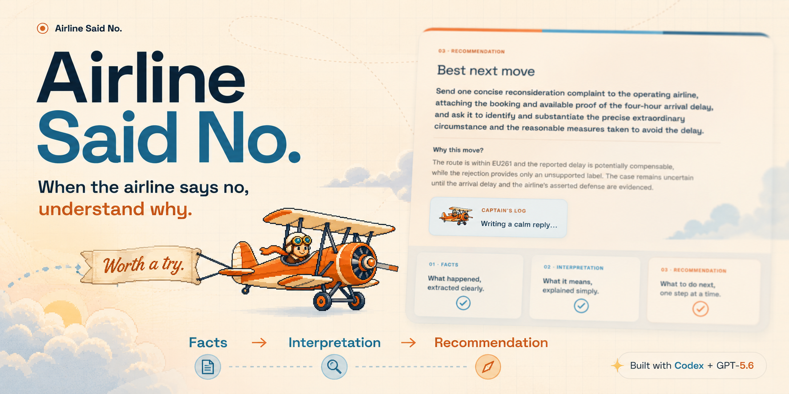
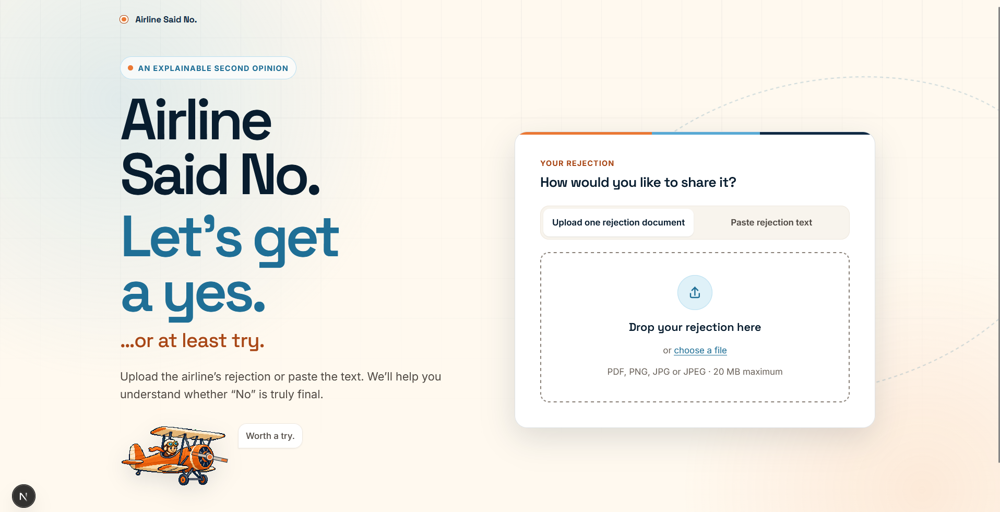
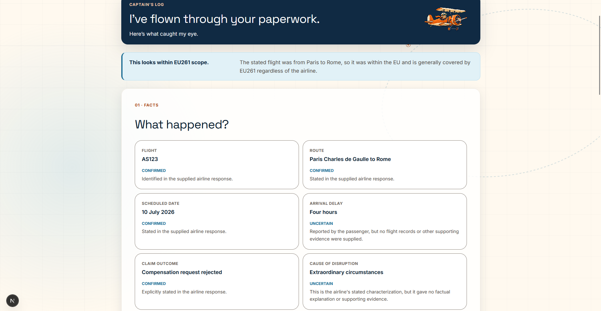
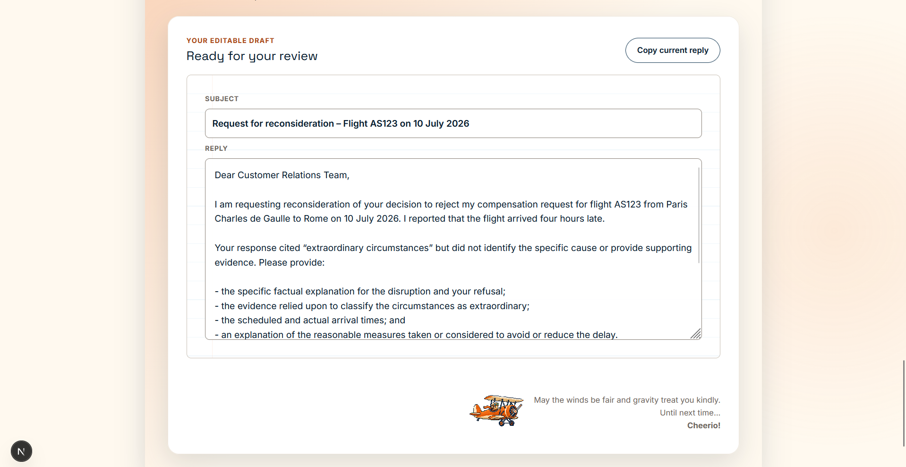

<p align="center">

</p>

<h1 align="center">✈️ Airline Said No</h1>

<p align="center">
An explainable second opinion for airline compensation refusals.
<br>
Built collaboratively with <strong>Codex</strong> and <strong>GPT-5.6</strong> for OpenAI Build Week 2026.
</p>

<p align="center">


</p>

---

# What is Airline Said No?

We've all been there.

You receive an email explaining that your compensation claim has been rejected. The explanation is often brief, sometimes vague, and it's not always clear whether the decision is justified or worth challenging.

**Airline Said No** doesn't promise compensation, and it doesn't replace legal advice.

Instead, it helps travellers understand what actually happened by reconstructing the facts, explaining the airline's reasoning, highlighting missing or contradictory information, and suggesting one realistic next step.

If appropriate, it can then draft a calm, editable reply that the traveller remains completely free to modify before sending.

Every analysis follows the same order:

1. Facts
2. Interpretation
3. Recommendation

---

# Built with Codex & GPT-5.6

Airline Said No was developed collaboratively with **Codex** and **GPT-5.6** throughout OpenAI Build Week.

## GPT-5.6

GPT-5.6 powers the core intelligence of the application by:

- extracting structured facts from airline correspondence;
- distinguishing confirmed facts from uncertainty;
- identifying missing or contradictory evidence;
- generating explainable recommendations;
- drafting calm, grounded, fully editable replies.

## Codex

Rather than treating Codex as a code generator, I used it as an engineering partner throughout the project.

Codex helped me:

- design the application architecture;
- implement the Next.js application;
- refine prompts and interaction flows;
- improve accessibility and keyboard support;
- harden privacy and security;
- write and expand automated tests;
- review production readiness;
- prepare deployment;
- improve documentation and developer experience.

While Codex accelerated implementation, I remained responsible for the product vision, interaction design, user experience, prompt direction, and iterative refinement.

---

# Gallery

| Landing page | Analysis | Draft reply |
|--------------|----------|-------------|
|  |  |  |

---

# 🎬 Demo Video

Watch a short demonstration of **Airline Said No** in action.

[](https://youtu.be/RR64KEt8Miw)

▶️ https://youtu.be/RR64KEt8Miw

---

# Features

- ✈️ Explain airline compensation refusals in plain language
- 📄 Analyse PDF, PNG, JPG/JPEG and pasted text
- 🧠 Structured reasoning powered by GPT-5.6
- 🔍 Separate confirmed facts from uncertainty
- ⚠️ Highlight missing and contradictory evidence
- ✉️ Draft a professional, fully editable follow-up reply
- 🔒 Privacy-first request-scoped document processing

---

# Trying it yourself

## Requirements

- Node.js 22.x
- npm
- Your own OpenAI API key

Clone the repository, copy `.env.example` to `.env.local`, add your API key, then run:

```bash
npm install
npm run dev
```

The application will be available at:

```text
http://localhost:3000
```

---

## Sample documents

The `samples/` folder contains fictional airline correspondence designed to exercise different reasoning paths.

Included scenarios cover:

- potentially compensable delays;
- extraordinary circumstances;
- non-EU261 journeys;
- weak claims;
- contradictory information.

All sample documents were created specifically for this project. No real passenger data is included.

---

# Environment variables

| Variable | Required | Description |
|----------|----------|-------------|
| `OPENAI_API_KEY` | ✅ | Your OpenAI API key. Never exposed to the browser. |
| `OPENAI_MODEL` | Optional | Defaults to `gpt-5.6`. |

---

# Available scripts

| Command | Description |
|---------|-------------|
| `npm run dev` | Start the development server |
| `npm run build` | Create a production build |
| `npm run start` | Run the production build locally |
| `npm test` | Run the automated test suite |
| `npm run test:watch` | Watch mode |
| `npm run lint` | ESLint |
| `npm run typecheck` | Strict TypeScript |
| `npm run format` | Format files |
| `npm run format:check` | Check formatting |
| `npm run check` | Run formatting, linting and type checking |

---

# Project structure

```text
src/
├── app/
├── components/
│   ├── mascot/
│   └── ui/
├── config/
├── features/
└── styles/

samples/
docs/
```

---

# Architecture

Key engineering decisions include:

- Next.js App Router
- Server Components by default
- OpenAI Responses API
- Structured Outputs with Zod validation
- Request-scoped document processing
- No document persistence
- `store: false` on OpenAI requests
- Strict TypeScript
- Comprehensive automated testing
- Accessibility-first interface
- Keyboard navigation
- Reduced-motion support

---

# Deployment

The application is ready for deployment on Vercel.

For this Build Week submission it is intentionally demonstrated locally, allowing judges to use their own OpenAI API key when running the project.

Everything required for deployment is already included in the repository.

---

# Acknowledgements

Created for **OpenAI Build Week 2026** with **Codex** and **GPT-5.6**.

Special thanks to **Captain WorthATry** for flying through an alarming amount of paperwork.